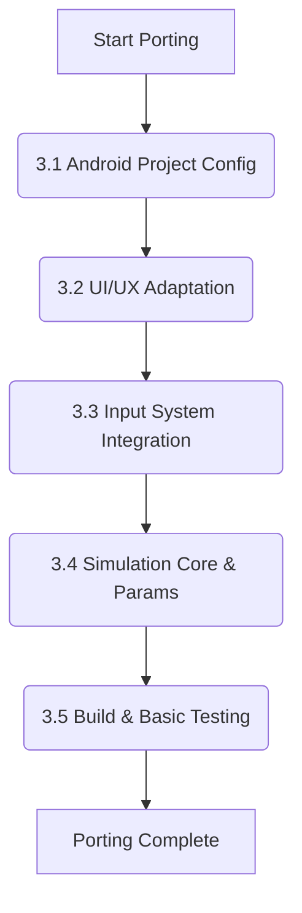

# Project Plan: Porting Mobile FLIP Fluid Simulation to Wear OS

## 1. Introduction & Goals

This document outlines the plan for porting the existing Flutter-based FLIP fluid simulation application from a mobile platform to Wear OS.

**Primary Goals:**

*   Adapt the application to be fully functional and user-friendly on Wear OS devices.
*   Ensure the core fluid simulation logic ([`lib/flip_fluid_simulation.dart`](lib/flip_fluid_simulation.dart)) is correctly integrated and performs adequately.
*   Implement Wear OS-specific input mechanisms, including touch, accelerometer, and rotary input, referencing [`docs/wearos_flutter_input_guide.md`](docs/wearos_flutter_input_guide.md).
*   Modify Android project configurations ([`android/app/build.gradle`](android/app/build.gradle), [`android/app/src/main/AndroidManifest.xml`](android/app/src/main/AndroidManifest.xml)) for Wear OS compatibility.
*   Maintain the existing infrastructure for simulation parameter handling ([`SimOptions`](lib/simulation_screen.dart:367) in [`lib/simulation_screen.dart`](lib/simulation_screen.dart:1)), using default parameters for the Wear OS version.
*   Establish a strategy for documenting potential future improvements to the simulation logic separately.

**Scope Limitation:** This plan focuses on analysis, configuration, UI/UX adaptation, and input integration for Wear OS. No modifications to the core simulation algorithms or formulas in [`lib/flip_fluid_simulation.dart`](lib/flip_fluid_simulation.dart) will be made during this porting process.

## 2. Pre-requisites & Assumptions

*   The existing Flutter project structure is as provided.
*   The core simulation logic in [`lib/flip_fluid_simulation.dart`](lib/flip_fluid_simulation.dart) is functional and suitable for integration.
*   The FFI native component (`simulation_native`) is compatible or can be made compatible with Wear OS arm architectures.
*   Developer access to Wear OS emulators and, ideally, physical test devices.
*   Familiarity with Flutter development and Wear OS specific considerations.

## 3. Core Task Breakdown

### 3.1. Android Project Configuration for Wear OS

*   **Goal:** Modify Android-specific files to declare the app as a Wear OS application and ensure compatibility.
*   **Key Activities & Considerations:**
    *   **[`android/app/src/main/AndroidManifest.xml`](android/app/src/main/AndroidManifest.xml) Modifications:**
        *   Add `<uses-feature android:name="android.hardware.type.watch" />` to declare the app for watches.
        *   Add `<meta-data android:name="com.google.android.wearable.standalone" android:value="true" />` within the `<application>` tag if the app is intended to be standalone (recommended for new Wear OS apps). If it requires a companion, set to `false`. For this simulation, `true` seems appropriate.
        *   Review and add necessary permissions. `WAKE_LOCK` might be needed if the simulation needs to keep the screen on. Sensor permissions are likely handled by `sensors_plus` but should be verified.
        *   Ensure the `<activity>` intent filters are appropriate for a Wear OS app (usually `MAIN` and `LAUNCHER` are fine for the primary activity).
        *   Consider using a Wear OS specific theme (e.g., `Theme.DeviceDefault.Light`) or adapt the existing theme for round screens and ambient mode if applicable. For now, the existing theme will be used, with UI adjustments handled in Flutter code.
    *   **[`android/app/build.gradle`](android/app/build.gradle) Review:**
        *   Verify `minSdkVersion`. Flutter's default (often 21) is generally compatible with modern Wear OS.
        *   Check for any dependencies that might conflict with Wear OS or if Wear OS specific support libraries are needed (though Flutter aims to abstract this).
        *   Ensure NDK and CMake configurations for the native simulation code are compatible with Wear OS target ABIs (e.g., `arm64-v8a`, `armeabi-v7a`).
*   **Files to Examine/Modify:**
    *   [`android/app/src/main/AndroidManifest.xml`](android/app/src/main/AndroidManifest.xml)
    *   [`android/app/build.gradle`](android/app/build.gradle)

### 3.2. UI/UX Adaptation for Wear OS

*   **Goal:** Adapt the existing UI ([`lib/simulation_screen.dart`](lib/simulation_screen.dart)) for the constraints and conventions of Wear OS (smaller, often round screens).
*   **Key Activities & Considerations:**
    *   **Screen Layout:**
        *   The main simulation view (`CustomPaint` with `ParticleRenderer`) needs to fit well within typical Wear OS screen dimensions (e.g., 1.2" to 1.4" displays, often 360x360 to 450x450 pixels).
        *   The `ParticleRenderer` itself should adapt to the circular nature of many Wear OS screens, ensuring particles are visible and interactions make sense within a circular viewport if the simulation's `sceneCircleRadius` is tied to screen dimensions.
        *   The top app bar (`Text('Slosh O'Clock')` and IconButtons) needs to be compact and not obstruct the view. Consider using `flutter_wear_os_libs` for standard Wear OS UI elements if decided later, but for now, adapt existing widgets.
    *   **Controls (`_openConfigPanel`, FloatingActionButtons):**
        *   The modal bottom sheet for configuration (`_openConfigPanel`) is likely too large and complex for Wear OS. It needs to be significantly simplified or re-thought. Options:
            *   A series of simpler, paginated screens.
            *   Using rotary input to cycle through and adjust parameters.
            *   Reducing the number of configurable parameters directly accessible on the watch.
        *   FloatingActionButtons for Start/Stop and Reset need to be easily tappable and might need repositioning for round screens (e.g., using a `CurvedNavigationBar` or similar Wear OS pattern, or simply ensuring they are inset appropriately).
    *   **Readability:** Ensure text and icons are legible on small screens.
    *   **Performance:** UI interactions should be smooth. Avoid overly complex layouts that could degrade performance.
*   **Files to Examine/Modify:**
    *   [`lib/simulation_screen.dart`](lib/simulation_screen.dart)
    *   [`lib/particle_renderer.dart`](lib/particle_renderer.dart) (for adapting to screen shape/size)
    *   [`lib/control_buttons.dart`](lib/control_buttons.dart) (if these are separate, or the equivalent logic in `SimulationScreen`)

### 3.3. Input System Integration for Wear OS

*   **Goal:** Implement and adapt input methods suitable for Wear OS, leveraging [`docs/wearos_flutter_input_guide.md`](docs/wearos_flutter_input_guide.md).
*   **Key Activities & Considerations:**
    *   **Touch Input:**
        *   The existing `GestureDetector` for `onPanStart`, `onPanUpdate`, `onPanEnd` ([`lib/simulation_screen.dart`](lib/simulation_screen.dart:321)) to control the obstacle needs to be tested for usability on small screens. Hit targets might need to be more generous.
        *   Ensure coordinate mapping (`_toSimCoords`) is accurate for Wear OS screen densities and sizes.
    *   **Accelerometer Input:**
        *   The existing `SensorService` and `accelerometerStream` ([`lib/simulation_screen.dart`](lib/simulation_screen.dart:65)) should theoretically work.
        *   Verify sensor data mapping to gravity is intuitive on a watch (considering typical watch orientations).
        *   Test sensitivity and responsiveness.
    *   **Rotary Input (Bezel/Crown):**
        *   This will be a new implementation.
        *   Follow the platform channel approach detailed in [`docs/wearos_flutter_input_guide.md`](docs/wearos_flutter_input_guide.md):
            *   **Native Side (Kotlin):** Modify [`android/app/src/main/kotlin/com/example/water_slosher_250428/MainActivity.kt`](android/app/src/main/kotlin/com/example/water_slosher_250428/MainActivity.kt) to override `onGenericMotionEvent`, detect rotary events, and send data via a `MethodChannel`.
            *   **Dart Side:** Create a `BezelChannel` (e.g., in [`lib/bezel_channel.dart`](lib/bezel_channel.dart)) to listen for events from the native side.
            *   Integrate rotary events into [`lib/simulation_screen.dart`](lib/simulation_screen.dart) to control a UI element or simulation parameter (e.g., obstacle size, simulation speed, or navigate the simplified config).
*   **Files to Examine/Modify:**
    *   [`lib/simulation_screen.dart`](lib/simulation_screen.dart) (for touch, accelerometer, and integrating rotary)
    *   [`android/app/src/main/kotlin/com/example/water_slosher_250428/MainActivity.kt`](android/app/src/main/kotlin/com/example/water_slosher_250428/MainActivity.kt) (for native rotary input)
    *   New file: [`lib/bezel_channel.dart`](lib/bezel_channel.dart) (for Dart side of rotary platform channel)
    *   [`docs/wearos_flutter_input_guide.md`](docs/wearos_flutter_input_guide.md) (as primary reference)

### 3.4. Simulation Core Integration & Parameter Handling

*   **Goal:** Ensure the existing simulation logic ([`lib/flip_fluid_simulation.dart`](lib/flip_fluid_simulation.dart)) runs correctly on Wear OS and that simulation parameters are managed appropriately.
*   **Key Activities & Considerations:**
    *   **Core Logic:** The simulation logic itself is not to be changed. Focus is on ensuring it's called correctly and its FFI dependencies work on Wear OS.
    *   **Parameter Management:**
        *   The `SimOptions` class ([`lib/simulation_screen.dart`](lib/simulation_screen.dart:367)) will be retained.
        *   The Wear OS version should use sensible default parameters optimized for performance and visual clarity on a small screen.
        *   The infrastructure for changing parameters (even if the UI for it is simplified or relies on rotary input) should be maintained.
    *   **Performance:**
        *   Monitor simulation performance (FPS, CPU usage) on Wear OS. The existing simulation is computationally intensive.
        *   Default particle count (`simOptions.particleCount`) might need to be reduced for Wear OS to maintain acceptable performance.
    *   **Rendering:** Ensure `ParticleRenderer` correctly visualizes the simulation state provided by `FlipFluidSimulation` on Wear OS.
*   **Files to Examine/Modify:**
    *   [`lib/simulation_screen.dart`](lib/simulation_screen.dart) (for initializing `FlipFluidSimulation` with appropriate defaults and passing parameters)
    *   [`lib/flip_fluid_simulation.dart`](lib/flip_fluid_simulation.dart) (no changes to logic, but verify FFI linkage)
    *   [`lib/particle_renderer.dart`](lib/particle_renderer.dart)

### 3.5. Build and Basic Testing on Wear OS

*   **Goal:** Successfully build the application for a Wear OS target and perform initial functional and usability tests.
*   **Key Activities & Considerations:**
    *   **Build Process:** Configure Flutter/Gradle to build for Wear OS (arm architecture).
    *   **Emulator Testing:** Set up and use Wear OS emulators (round, square, different API levels).
    *   **Physical Device Testing:** If available, test on actual Wear OS hardware for realistic performance and input feel.
    *   **Test Focus:**
        *   App installation and launch.
        *   UI rendering on different screen shapes/sizes.
        *   Responsiveness of touch, accelerometer, and rotary inputs.
        *   Basic simulation functionality (fluid movement, obstacle interaction).
        *   Performance (visual smoothness, battery impact if observable).
        *   Crash testing.

## 4. Documentation Strategy for Simulation Improvements

*   **Goal:** Establish a clear method for recording potential simulation enhancements or optimizations identified during the porting process, without implementing them as part of this subtask.
*   **Method:**
    *   A new Markdown file, e.g., `docs/simulation_enhancement_ideas.md`, will be created.
    *   During the porting process, if any ideas for improving the simulation logic, performance (beyond parameter tuning), or visual fidelity arise, they will be briefly documented in this file.
    *   Each entry should include a short description of the idea and why it might be beneficial.
    *   This ensures these ideas are captured for future consideration without scope creep in the current porting task. The existing [`docs/llm_unreq_sim_changes.md`](docs/llm_unreq_sim_changes.md) can also be used or consolidated.

## 5. Timeline & Milestones (High-Level Estimate)

*   **Phase 1: Configuration & Initial UI Adaptation (Estimate: X days)**
    *   Milestone: Android project configured for Wear OS. Basic UI shell adapted.
*   **Phase 2: Input Integration (Estimate: Y days)**
    *   Milestone: Touch, accelerometer, and rotary inputs functional.
*   **Phase 3: Simulation Integration & Testing (Estimate: Z days)**
    *   Milestone: Simulation running with default parameters. Basic testing passed on emulator/device.
*   **Phase 4: Final Polish & Documentation (Estimate: W days)**
    *   Milestone: Project plan (`wear_os_porting_plan.md`) finalized. Simulation improvement ideas documented.

*(Specific day estimates are placeholders and would be refined based on developer availability and complexity encountered.)*

## 6. Potential Risks & Mitigation

*   **Performance Issues:** The simulation might be too demanding for Wear OS hardware.
    *   *Mitigation:* Prioritize performance testing early. Be prepared to significantly reduce default particle counts or simplify rendering if necessary. Profile to identify bottlenecks.
*   **FFI Compatibility:** The native C++ code might have issues on Wear OS (e.g., different ABI, library dependencies).
    *   *Mitigation:* Test native code compilation and execution on Wear OS targets early.
*   **Rotary Input Complexity:** Implementing the platform channel for rotary input can be tricky.
    *   *Mitigation:* Closely follow the guide ([`docs/wearos_flutter_input_guide.md`](docs/wearos_flutter_input_guide.md)). Allocate sufficient time for debugging.
*   **UI/UX Challenges:** Designing an intuitive UI for complex settings on a small screen is difficult.
    *   *Mitigation:* Prioritize simplicity. Focus on core functionality for the on-watch UI. Leverage rotary input for navigation where possible.
*   **Testing Limitations:** Lack of diverse physical Wear OS devices.
    *   *Mitigation:* Utilize a range of emulators. If possible, acquire at least one common physical device for testing.

This plan provides a structured approach to porting the application. Each step will require careful implementation and testing.